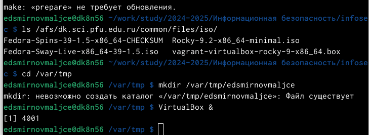
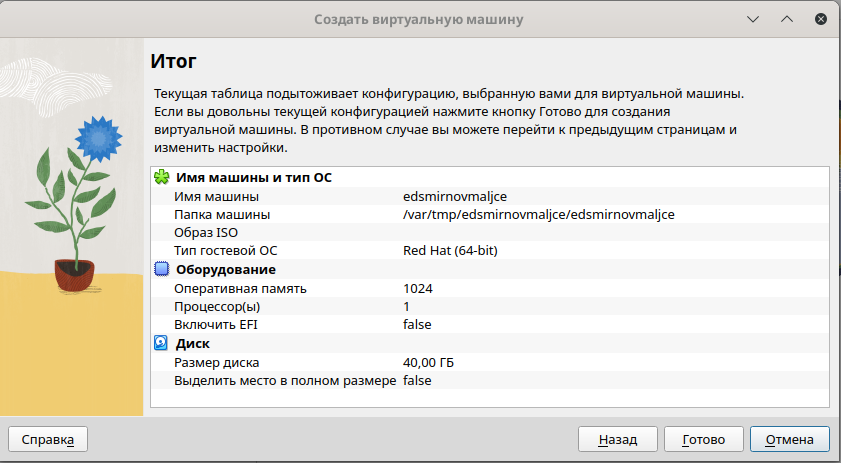
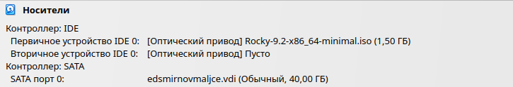
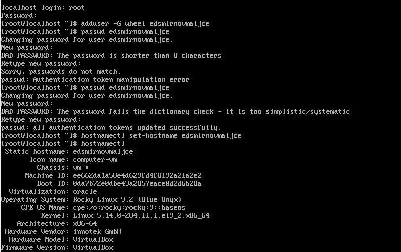
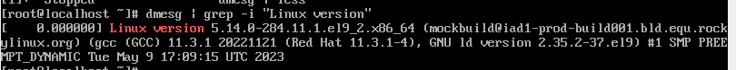

---
## Front matter
title: "Отчёт по лабораторной работе 1"
subtitle: "Создание виртуальной машины"
author: "Смирнов-Мальцев Егор Дмитриевич"

## Generic otions
lang: ru-RU
toc-title: "Содержание"

## Bibliography
bibliography: bib/cite.bib
csl: pandoc/csl/gost-r-7-0-5-2008-numeric.csl

## Pdf output format
toc: true # Table of contents
toc-depth: 2
lof: true # List of figures
lot: true # List of tables
fontsize: 12pt
linestretch: 1.5
papersize: a4
documentclass: scrreprt
## I18n polyglossia
polyglossia-lang:
  name: russian
  options:
	- spelling=modern
	- babelshorthands=true
polyglossia-otherlangs:
  name: english
## I18n babel
babel-lang: russian
babel-otherlangs: english
## Fonts
mainfont: IBM Plex Serif
romanfont: IBM Plex Serif
sansfont: IBM Plex Sans
monofont: IBM Plex Mono
mathfont: STIX Two Math
mainfontoptions: Ligatures=Common,Ligatures=TeX,Scale=0.94
romanfontoptions: Ligatures=Common,Ligatures=TeX,Scale=0.94
sansfontoptions: Ligatures=Common,Ligatures=TeX,Scale=MatchLowercase,Scale=0.94
monofontoptions: Scale=MatchLowercase,Scale=0.94,FakeStretch=0.9
mathfontoptions:
## Biblatex
biblatex: true
biblio-style: "gost-numeric"
biblatexoptions:
  - parentracker=true
  - backend=biber
  - hyperref=auto
  - language=auto
  - autolang=other*
  - citestyle=gost-numeric
## Pandoc-crossref LaTeX customization
figureTitle: "Рис."
tableTitle: "Таблица"
listingTitle: "Листинг"
lofTitle: "Список иллюстраций"
lotTitle: "Список таблиц"
lolTitle: "Листинги"
## Misc options
indent: true
header-includes:
  - \usepackage{indentfirst}
  - \usepackage{float} # keep figures where there are in the text
  - \floatplacement{figure}{H} # keep figures where there are in the text
---

# Цель работы

Цель работы --- создать виртуальную машину для будущих лабораторных работ.

# Задание

1. Создать виртуальную машину.
2. Создать аккаунт.
3. Выполнить домашнее задание.

# Теоретическое введение

 Виртуальной машиной (англ. virtual machine) называется компьютерная программа, предоставляющая средства виртуализации компьютера, то есть средства имитации оборудования для работы гостевой операционной системы. Грубо говоря, это программа, позволяющая запускать одну операционную систему внутри другой операционной системы и работать с ней практически как с обычным приложением. Операционная система, установленная внутри ВМ, называется гостевой.

Средства, занимающиеся виртуализацией компьютера, можно разделить на серверные и настольные. Первые работают на серверах и называются гипервизорами. Как правило, используются для запуска одновременно большого количества виртуальных машин. Затем эти машины сдаются в аренду другим пользователям. Вторые называются виртуальными машинами и используются для запуска ВМ для персонального использования. Настольные средства также позволяют запускать одновременно несколько ВМ, но они не предназначены для запуска большого количества «виртуалок». 

# Выполнение лабораторной работы

Настроил папку для хранения виртуальной машины и открыл VirtualBox (рис. [-@fig:001]).

{#fig:001 width=70%}

Создал виртуальную машину (рис. [-@fig:002]).

{#fig:002 width=70%}

Добавил носитель с нужной операционной системой (рис. [-@fig:003]).

{#fig:003 width=70%}

Запустил операционную систему и создал свою учетную запись (рис. [-@fig:004]).

{#fig:004 width=70%}

Выполнил домашнее задание (рис. [-@fig:005]).

{#fig:005 width=70%}

# Выводы

Виртуальная машина была установлена.

# Список литературы{.unnumbered}

::: {#refs}
:::
