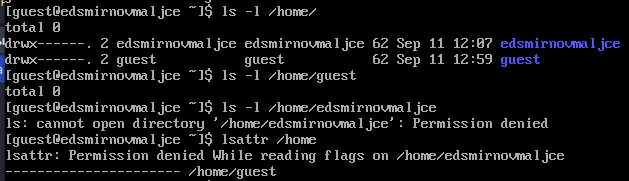

---
## Front matter
lang: ru-RU
title: Основы информационной безопасности
subtitle: Лабораторная работа № 2. Дискреционное разграничение прав в Linux. Основные атрибуты
author:
  - Смирнов-Мальцев Е. Д.
institute:
  - Российский университет дружбы народов, Москва, Россия
date: 13 сентября 2024

## i18n babel
babel-lang: russian
babel-otherlangs: english

## Formatting pdf
toc: false
toc-title: Содержание
slide_level: 2
aspectratio: 169
section-titles: true
theme: metropolis
header-includes:
 - \metroset{progressbar=frametitle,sectionpage=progressbar,numbering=fraction}
---

# Информация

## Докладчик

:::::::::::::: {.columns align=center}
::: {.column width="70%"}

  * Смирнов-Мальцев Егор Дмитриевич
  * студент группы НКНбд-01-21
  * Российский университет дружбы народов
  
:::
::::::::::::::

# Цель работы

Получение практических навыков работы в консоли с атрибутами файлов, закрепление теоретических основ дискреционного разграничения доступа в современных системах с открытым кодом на базе ОС Linux.

# Теоретическое введение

Всего есть 2 вида моделей разграничения доступа: дискреционная и мандатная. Эта модель в том или ином виде реализована почти во всех современных *nix-системах. В англоязычных ресурсах можно встретить название DAC (Discretionary Access Control).                                                                                |

Более подробно про Unix см. в [@tanenbaum_book_modern-os_ru; @robbins_book_bash_en; @zarrelli_book_mastering-bash_en; @newham_book_learning-bash_en].

# Выполнение лабораторной работы

Добавил гостевого пользователя.

{#fig:001 width=70%}

# Выполнение лабораторной работы

Перешел в учетную запись гостевого пользователя.

{#fig:002 width=70%}

# Выполнение лабораторной работы

Просмотрел кто я, свое id и группу.

{#fig:003 width=70%}

# Выполнение лабораторной работы

Проверил файл /etc/passwd.

{#fig:004 width=70%}

# Выполнение лабораторной работы

Проверил есть ли права на просмотр других директорий.

{#fig:005 width=70%}

# Выполнение лабораторной работы

Создал директорию и изменил ее права.

{#fig:006 width=70%}

# Выполнение лабораторной работы

Попробовал создать файл в директории.

{#fig:007 width=70%}

# Выводы

Получена информация о доступе к файлам.
