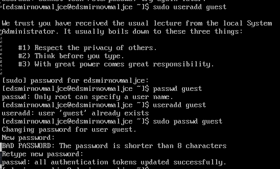
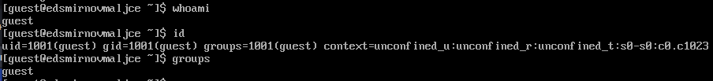
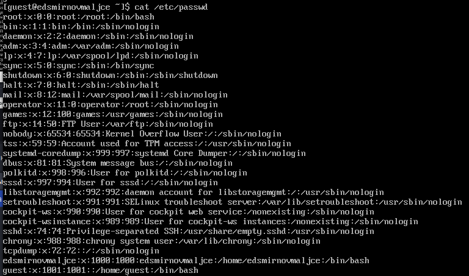
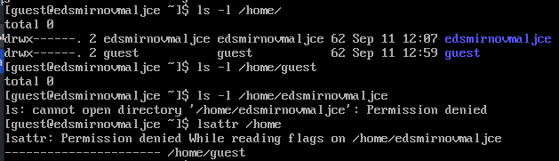
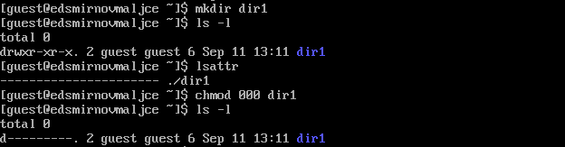

---
## Front matter
title: "Основы информационной безопасности"
subtitle: "Лабораторная работа № 2. Дискреционное разграничение прав в Linux. Основные атрибуты"
author: "Смирнов-Мальцев Егор Дмитриевич"

## Generic otions
lang: ru-RU
toc-title: "Содержание"

## Bibliography
bibliography: bib/cite.bib
csl: pandoc/csl/gost-r-7-0-5-2008-numeric.csl

## Pdf output format
toc: true # Table of contents
toc-depth: 2
lof: true # List of figures
lot: false # List of tables
fontsize: 12pt
linestretch: 1.5
papersize: a4
documentclass: scrreprt
## I18n polyglossia
polyglossia-lang:
  name: russian
  options:
	- spelling=modern
	- babelshorthands=true
polyglossia-otherlangs:
  name: english
## I18n babel
babel-lang: russian
babel-otherlangs: english
## Fonts
mainfont: PT Serif
romanfont: PT Serif
sansfont: PT Sans
monofont: PT Mono
mainfontoptions: Ligatures=TeX
romanfontoptions: Ligatures=TeX
sansfontoptions: Ligatures=TeX,Scale=MatchLowercase
monofontoptions: Scale=MatchLowercase,Scale=0.9
## Biblatex
biblatex: true
biblio-style: "gost-numeric"
biblatexoptions:
  - parentracker=true
  - backend=biber
  - hyperref=auto
  - language=auto
  - autolang=other*
  - citestyle=gost-numeric
## Pandoc-crossref LaTeX customization
figureTitle: "Рис."
tableTitle: "Таблица"
listingTitle: "Листинг"
lofTitle: "Список иллюстраций"
lotTitle: "Список таблиц"
lolTitle: "Листинги"
## Misc options
indent: true
header-includes:
  - \usepackage{indentfirst}
  - \usepackage{float} # keep figures where there are in the text
  - \floatplacement{figure}{H} # keep figures where there are in the text
---

# Цель работы

Получение практических навыков работы в консоли с атрибутами файлов, закрепление теоретических основ дискреционного разграничения доступа в современных системах с открытым кодом на базе ОС Linux.

# Теоретическое введение

Всего есть 2 вида моделей разграничения доступа: дискреционная и мандатная. Эта модель в том или ином виде реализована почти во всех современных *nix-системах. В англоязычных ресурсах можно встретить название DAC (Discretionary Access Control).                                                                                |

Более подробно про Unix см. в [@tanenbaum_book_modern-os_ru; @robbins_book_bash_en; @zarrelli_book_mastering-bash_en; @newham_book_learning-bash_en].

# Выполнение лабораторной работы

Добавил гостевого пользователя (рис. @fig:001).

{#fig:001 width=70%}

Перешел в учетную запись гостевого пользователя (рис. @fig:002).

{#fig:002 width=70%}

Просмотрел кто я, свое id и группу (рис. @fig:003).

{#fig:003 width=70%}

Проверил файл /etc/passwd (рис. @fig:004).

{#fig:004 width=70%}

Проверил есть ли права на просмотр других директорий (рис. @fig:005).

{#fig:005 width=70%}

Создал директорию и изменил ее права (рис. @fig:006).

{#fig:006 width=70%}

Попробовал создать файл в директории (рис. @fig:007).

{#fig:007 width=70%}

В табл. [-@tbl:tbl1] приведены данные о том, какие операции разрешены, а какие нет для владельца данных.

: Установленные права и разрешённые действия {#tbl:tbl1}

| Права директории | Права файла | Создание файла | Удаление файла | Запись в файл | Чтение файла | Смена директории | Просмотр файлов в директории | Переименование файла | Смена атрибутов файла |
|----------------------|-----------|--------|--------|--------|--------|--------|--------|--------|--------|
|   d(000)   |   (000)   |    -    |    -    |    -    |    -    |    -    |    -    |    -    |    -    |
|   d(100)   |   (000)   |    -    |    -    |    -    |    -    |    +    |    -    |    -    |    +    |
|   d(200)   |   (000)   |    -    |    -    |    -    |    -    |    -    |    -    |    -    |    -    |
|   d(300)   |   (000)   |    +    |    +    |    -    |    -    |    +    |    -    |    +    |    +    |
|   d(400)   |   (000)   |    -    |    -    |    -    |    -    |    -    |    +    |    -    |    -    |
|   d(500)   |   (000)   |    -    |    -    |    -    |    -    |    +    |    +    |    -    |    +    |
|   d(600)   |   (000)   |    -    |    -    |    -    |    -    |    -    |    +    |    -    |    -    |
|   d(700)   |   (000)   |    +    |    +    |    -    |    -    |    +    |    +    |    +    |    +    |
|   d(000)   |   (100)   |    -    |    -    |    -    |    -    |    -    |    -    |    -    |    -    |
|   d(100)   |   (100)   |    -    |    -    |    -    |    -    |    +    |    -    |    -    |    +    |
|   d(200)   |   (100)   |    -    |    -    |    -    |    -    |    -    |    -    |    -    |    -    |
|   d(300)   |   (100)   |    +    |    +    |    -    |    -    |    +    |    -    |    +    |    +    |
|   d(400)   |   (100)   |    -    |    -    |    -    |    -    |    -    |    +    |    -    |    -    |
|   d(500)   |   (100)   |    -    |    -    |    -    |    -    |    +    |    +    |    -    |    +    |
|   d(600)   |   (100)   |    -    |    -    |    -    |    -    |    -    |    +    |    -    |    -    |
|   d(700)   |   (100)   |    +    |    +    |    -    |    -    |    +    |    +    |    +    |    +    |
|   d(000)   |   (200)   |    -    |    -    |    -    |    -    |    -    |    -    |    -    |    -    |
|   d(100)   |   (200)   |    -    |    -    |    +    |    -    |    +    |    -    |    -    |    +    |
|   d(200)   |   (200)   |    -    |    -    |    -    |    -    |    -    |    -    |    -    |    -    |
|   d(300)   |   (200)   |    +    |    +    |    +    |    -    |    +    |    -    |    +    |    +    |
|   d(400)   |   (200)   |    -    |    -    |    -    |    -    |    -    |    +    |    -    |    -    |
|   d(500)   |   (200)   |    -    |    -    |    +    |    -    |    +    |    +    |    -    |    +    |
|   d(600)   |   (200)   |    -    |    -    |    -    |    -    |    -    |    +    |    -    |    -    |
|   d(700)   |   (200)   |    +    |    +    |    +    |    -    |    +    |    +    |    +    |    +    |
|   d(000)   |   (300)   |    -    |    -    |    -    |    -    |    -    |    -    |    -    |    -    |
|   d(100)   |   (300)   |    -    |    -    |    +    |    -    |    +    |    -    |    -    |    +    |
|   d(200)   |   (300)   |    -    |    -    |    -    |    -    |    -    |    -    |    -    |    -    |
|   d(300)   |   (300)   |    +    |    +    |    +    |    -    |    +    |    -    |    +    |    +    |
|   d(400)   |   (300)   |    -    |    -    |    -    |    -    |    -    |    +    |    -    |    -    |
|   d(500)   |   (300)   |    -    |    -    |    +    |    -    |    +    |    +    |    -    |    +    |
|   d(600)   |   (300)   |    -    |    -    |    -    |    -    |    -    |    +    |    -    |    -    |
|   d(700)   |   (300)   |    +    |    +    |    +    |    -    |    +    |    +    |    +    |    +    |
|   d(000)   |   (400)   |    -    |    -    |    -    |    -    |    -    |    -    |    -    |    -    |
|   d(100)   |   (400)   |    -    |    -    |    -    |    +    |    +    |    -    |    -    |    +    |
|   d(200)   |   (400)   |    -    |    -    |    -    |    -    |    -    |    -    |    -    |    -    |
|   d(300)   |   (400)   |    +    |    +    |    -    |    +    |    +    |    -    |    +    |    +    |
|   d(400)   |   (400)   |    -    |    -    |    -    |    -    |    -    |    +    |    -    |    -    |
|   d(500)   |   (400)   |    -    |    -    |    -    |    +    |    +    |    +    |    -    |    +    |
|   d(600)   |   (400)   |    -    |    -    |    -    |    -    |    -    |    +    |    -    |    -    |
|   d(700)   |   (400)   |    +    |    +    |    -    |    +    |    +    |    +    |    +    |    +    |
|   d(000)   |   (500)   |    -    |    -    |    -    |    -    |    -    |    -    |    -    |    -    |
|   d(100)   |   (500)   |    -    |    -    |    -    |    +    |    +    |    -    |    -    |    +    |
|   d(200)   |   (500)   |    -    |    -    |    -    |    -    |    -    |    -    |    -    |    -    |
|   d(300)   |   (500)   |    +    |    +    |    -    |    +    |    +    |    -    |    +    |    +    |
|   d(400)   |   (500)   |    -    |    -    |    -    |    -    |    -    |    +    |    -    |    -    |
|   d(500)   |   (500)   |    -    |    -    |    -    |    +    |    +    |    +    |    -    |    +    |
|   d(600)   |   (500)   |    -    |    -    |    -    |    -    |    -    |    +    |    -    |    -    |
|   d(700)   |   (500)   |    +    |    +    |    -    |    +    |    +    |    +    |    +    |    +    |
|   d(000)   |   (600)   |    -    |    -    |    -    |    -    |    -    |    -    |    -    |    -    |
|   d(100)   |   (600)   |    -    |    -    |    +    |    +    |    +    |    -    |    -    |    +    |
|   d(200)   |   (600)   |    -    |    -    |    -    |    -    |    -    |    -    |    -    |    -    |
|   d(300)   |   (600)   |    +    |    +    |    +    |    +    |    +    |    -    |    +    |    +    |
|   d(400)   |   (600)   |    -    |    -    |    -    |    -    |    -    |    +    |    -    |    -    |
|   d(500)   |   (600)   |    -    |    -    |    +    |    +    |    +    |    +    |    -    |    +    |
|   d(600)   |   (600)   |    -    |    -    |    -    |    -    |    -    |    +    |    -    |    -    |
|   d(700)   |   (600)   |    +    |    +    |    +    |    +    |    +    |    +    |    +    |    +    |
|   d(000)   |   (700)   |    -    |    -    |    -    |    -    |    -    |    -    |    -    |    -    |
|   d(100)   |   (700)   |    -    |    -    |    +    |    +    |    +    |    -    |    -    |    +    |
|   d(200)   |   (700)   |    -    |    -    |    -    |    -    |    -    |    -    |    -    |    -    |
|   d(300)   |   (700)   |    +    |    +    |    +    |    +    |    +    |    -    |    +    |    +    |
|   d(400)   |   (700)   |    -    |    -    |    -    |    -    |    -    |    +    |    -    |    -    |
|   d(500)   |   (700)   |    -    |    -    |    +    |    +    |    +    |    +    |    -    |    +    |
|   d(600)   |   (700)   |    -    |    -    |    -    |    -    |    -    |    +    |    -    |    -    |
|   d(700)   |   (700)   |    +    |    +    |    +    |    +    |    +    |    +    |    +    |    +    |

В табл. [-@tbl:tbl2] приведены данные о том, какие минимальные права должны быть для совершения различных действий.

: Минимальные права для совершения операций {#tbl:tbl2}

| Операция | Минимальные права на директорию | Минимальные права на файл |
|----------|---------------------------------|---------------------------|
|Создание файла|            d(300)               |               (000)            |
|Удаление файла|            d(300)               |               (000)            |
|Чтение файла|            d(100)               |               (400)            |
|Запись в файл|            d(100)               |               (200)            |
|Переименование файла |            d(300)               |               (000)            |
|Создание поддиректории |            d(300)               |               (000)            |
|Удаление поддиректории |            d(300)               |               (000)            |

# Выводы

Получена информация о доступе к файлам.

# Список литературы{.unnumbered}

::: {#refs}
:::

