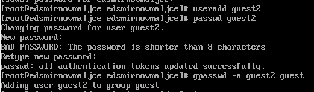
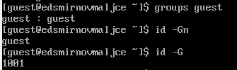
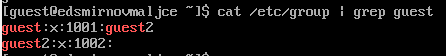
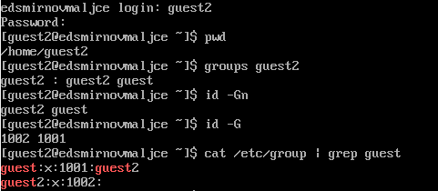
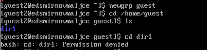

---
## Front matter
title: "Основы информационной безопасности"
subtitle: "Лабораторная работа № 3. Дискреционное разграничение прав в Linux. Два пользователя"
author: "Смирнов-Мальцев Егор Дмитриевич"

## Generic otions
lang: ru-RU
toc-title: "Содержание"

## Bibliography
bibliography: bib/cite.bib
csl: pandoc/csl/gost-r-7-0-5-2008-numeric.csl

## Pdf output format
toc: true # Table of contents
toc-depth: 2
lof: true # List of figures
lot: false # List of tables
fontsize: 12pt
linestretch: 1.5
papersize: a4
documentclass: scrreprt
## I18n polyglossia
polyglossia-lang:
  name: russian
  options:
	- spelling=modern
	- babelshorthands=true
polyglossia-otherlangs:
  name: english
## I18n babel
babel-lang: russian
babel-otherlangs: english
## Fonts
mainfont: PT Serif
romanfont: PT Serif
sansfont: PT Sans
monofont: PT Mono
mainfontoptions: Ligatures=TeX
romanfontoptions: Ligatures=TeX
sansfontoptions: Ligatures=TeX,Scale=MatchLowercase
monofontoptions: Scale=MatchLowercase,Scale=0.9
## Biblatex
biblatex: true
biblio-style: "gost-numeric"
biblatexoptions:
  - parentracker=true
  - backend=biber
  - hyperref=auto
  - language=auto
  - autolang=other*
  - citestyle=gost-numeric
## Pandoc-crossref LaTeX customization
figureTitle: "Рис."
tableTitle: "Таблица"
listingTitle: "Листинг"
lofTitle: "Список иллюстраций"
lotTitle: "Список таблиц"
lolTitle: "Листинги"
## Misc options
indent: true
header-includes:
  - \usepackage{indentfirst}
  - \usepackage{float} # keep figures where there are in the text
  - \floatplacement{figure}{H} # keep figures where there are in the text
---

# Цель работы

Получение практических навыков работы в консоли с атрибутами файлов для групп пользователей.

# Теоретическое введение

В Linux можно задавать права не только для себя и всех пользователей, но и для группы пользователей. Это можно делать с помощью команды chmod.                                                                                |

Более подробно про Unix см. в [@tanenbaum_book_modern-os_ru; @robbins_book_bash_en; @zarrelli_book_mastering-bash_en; @newham_book_learning-bash_en].

# Выполнение лабораторной работы

Создал второго гостевого пользователя и добавил его в группу первого (рис. @fig:001).

{#fig:001 width=70%}

Посмотрел информацию о группе первого пользователя командами groups и id (рис. @fig:002).

{#fig:002 width=70%}

Посмотрел эту же информацию в файле /etc/group (рис. @fig:003).

{#fig:003 width=70%}

Зашел в систему от имени второго гостевого пользователя и посмотрел ту же информацию (рис. @fig:004).

{#fig:004 width=70%}

Изменил права директорий от имени guest (рис. @fig:005).

{#fig:005 width=70%}

Проверил может ли войти guest2 в директории guest (рис. @fig:006).

{#fig:006 width=70%}

В табл. [-@tbl:tbl1] приведены данные о том, какие операции разрешены, а какие нет для владельца данных.

: Установленные права и разрешённые действия {#tbl:tbl1}

| Права директории | Права файла | Создание файла | Удаление файла | Запись в файл | Чтение файла | Смена директории | Просмотр файлов в директории | Переименование файла | Смена атрибутов файла |
|------------|-----------|---------|---------|---------|---------|---------|---------|---------|---------|
|   d(000)   |   (000)   |    -    |    -    |    -    |    -    |    -    |    -    |    -    |    -    |
|   d(010)   |   (000)   |    -    |    -    |    -    |    -    |    +    |    -    |    -    |    -    |
|   d(020)   |   (000)   |    -    |    -    |    -    |    -    |    -    |    -    |    -    |    -    |
|   d(030)   |   (000)   |    +    |    +    |    -    |    -    |    +    |    -    |    +    |    -    |
|   d(040)   |   (000)   |    -    |    -    |    -    |    -    |    -    |    +    |    -    |    -    |
|   d(050)   |   (000)   |    -    |    -    |    -    |    -    |    +    |    +    |    -    |    -    |
|   d(060)   |   (000)   |    -    |    -    |    -    |    -    |    -    |    +    |    -    |    -    |
|   d(070)   |   (000)   |    +    |    +    |    -    |    -    |    +    |    +    |    +    |    -    |
|   d(000)   |   (010)   |    -    |    -    |    -    |    -    |    -    |    -    |    -    |    -    |
|   d(010)   |   (010)   |    -    |    -    |    -    |    -    |    +    |    -    |    -    |    -    |
|   d(020)   |   (010)   |    -    |    -    |    -    |    -    |    -    |    -    |    -    |    -    |
|   d(030)   |   (010)   |    +    |    +    |    -    |    -    |    +    |    -    |    +    |    -    |
|   d(040)   |   (010)   |    -    |    -    |    -    |    -    |    -    |    +    |    -    |    -    |
|   d(050)   |   (010)   |    -    |    -    |    -    |    -    |    +    |    +    |    -    |    -    |
|   d(060)   |   (010)   |    -    |    -    |    -    |    -    |    -    |    +    |    -    |    -    |
|   d(070)   |   (010)   |    +    |    +    |    -    |    -    |    +    |    +    |    +    |    -    |
|   d(000)   |   (020)   |    -    |    -    |    -    |    -    |    -    |    -    |    -    |    -    |
|   d(010)   |   (020)   |    -    |    -    |    +    |    -    |    +    |    -    |    -    |    -    |
|   d(020)   |   (020)   |    -    |    -    |    -    |    -    |    -    |    -    |    -    |    -    |
|   d(030)   |   (020)   |    +    |    +    |    +    |    -    |    +    |    -    |    +    |    -    |
|   d(040)   |   (020)   |    -    |    -    |    -    |    -    |    -    |    +    |    -    |    -    |
|   d(050)   |   (020)   |    -    |    -    |    +    |    -    |    +    |    +    |    -    |    -    |
|   d(060)   |   (020)   |    -    |    -    |    -    |    -    |    -    |    +    |    -    |    -    |
|   d(070)   |   (020)   |    +    |    +    |    +    |    -    |    +    |    +    |    +    |    -    |
|   d(000)   |   (030)   |    -    |    -    |    -    |    -    |    -    |    -    |    -    |    -    |
|   d(010)   |   (030)   |    -    |    -    |    +    |    -    |    +    |    -    |    -    |    -    |
|   d(020)   |   (030)   |    -    |    -    |    -    |    -    |    -    |    -    |    -    |    -    |
|   d(030)   |   (030)   |    +    |    +    |    +    |    -    |    +    |    -    |    +    |    -    |
|   d(040)   |   (030)   |    -    |    -    |    -    |    -    |    -    |    +    |    -    |    -    |
|   d(050)   |   (030)   |    -    |    -    |    +    |    -    |    +    |    +    |    -    |    -    |
|   d(060)   |   (030)   |    -    |    -    |    -    |    -    |    -    |    +    |    -    |    -    |
|   d(070)   |   (030)   |    +    |    +    |    +    |    -    |    +    |    +    |    +    |    -    |
|   d(000)   |   (040)   |    -    |    -    |    -    |    -    |    -    |    -    |    -    |    -    |
|   d(010)   |   (040)   |    -    |    -    |    -    |    +    |    +    |    -    |    -    |    -    |
|   d(020)   |   (040)   |    -    |    -    |    -    |    -    |    -    |    -    |    -    |    -    |
|   d(030)   |   (040)   |    +    |    +    |    -    |    +    |    +    |    -    |    +    |    -    |
|   d(040)   |   (040)   |    -    |    -    |    -    |    -    |    -    |    +    |    -    |    -    |
|   d(050)   |   (040)   |    -    |    -    |    -    |    +    |    +    |    +    |    -    |    -    |
|   d(060)   |   (040)   |    -    |    -    |    -    |    -    |    -    |    +    |    -    |    -    |
|   d(070)   |   (040)   |    +    |    +    |    -    |    +    |    +    |    +    |    +    |    -    |
|   d(000)   |   (050)   |    -    |    -    |    -    |    -    |    -    |    -    |    -    |    -    |
|   d(010)   |   (050)   |    -    |    -    |    -    |    +    |    +    |    -    |    -    |    -    |
|   d(020)   |   (050)   |    -    |    -    |    -    |    -    |    -    |    -    |    -    |    -    |
|   d(030)   |   (050)   |    +    |    +    |    -    |    +    |    +    |    -    |    +    |    -    |
|   d(040)   |   (050)   |    -    |    -    |    -    |    -    |    -    |    +    |    -    |    -    |
|   d(050)   |   (050)   |    -    |    -    |    -    |    +    |    +    |    +    |    -    |    -    |
|   d(060)   |   (050)   |    -    |    -    |    -    |    -    |    -    |    +    |    -    |    -    |
|   d(070)   |   (050)   |    +    |    +    |    -    |    +    |    +    |    +    |    +    |    -    |
|   d(000)   |   (060)   |    -    |    -    |    -    |    -    |    -    |    -    |    -    |    -    |
|   d(010)   |   (060)   |    -    |    -    |    +    |    +    |    +    |    -    |    -    |    -    |
|   d(020)   |   (060)   |    -    |    -    |    -    |    -    |    -    |    -    |    -    |    -    |
|   d(030)   |   (060)   |    +    |    +    |    +    |    +    |    +    |    -    |    +    |    -    |
|   d(040)   |   (060)   |    -    |    -    |    -    |    -    |    -    |    +    |    -    |    -    |
|   d(050)   |   (060)   |    -    |    -    |    +    |    +    |    +    |    +    |    -    |    -    |
|   d(060)   |   (060)   |    -    |    -    |    -    |    -    |    -    |    +    |    -    |    -    |
|   d(070)   |   (060)   |    +    |    +    |    +    |    +    |    +    |    +    |    +    |    -    |
|   d(000)   |   (070)   |    -    |    -    |    -    |    -    |    -    |    -    |    -    |    -    |
|   d(010)   |   (070)   |    -    |    -    |    +    |    +    |    +    |    -    |    -    |    -    |
|   d(020)   |   (070)   |    -    |    -    |    -    |    -    |    -    |    -    |    -    |    -    |
|   d(030)   |   (070)   |    +    |    +    |    +    |    +    |    +    |    -    |    +    |    -    |
|   d(040)   |   (070)   |    -    |    -    |    -    |    -    |    -    |    +    |    -    |    -    |
|   d(050)   |   (070)   |    -    |    -    |    +    |    +    |    +    |    +    |    -    |    -    |
|   d(060)   |   (070)   |    -    |    -    |    -    |    -    |    -    |    +    |    -    |    -    |
|   d(070)   |   (070)   |    +    |    +    |    +    |    +    |    +    |    +    |    +    |    -    |

В табл. [-@tbl:tbl2] приведены данные о том, какие минимальные права должны быть для совершения различных действий.

: Минимальные права для совершения операций {#tbl:tbl2}

| Операция | Минимальные права на директорию | Минимальные права на файл |
|-----------------------|------------|-----------|
|Создание файла|            d(030)               |               (000)            |
|Удаление файла|            d(030)               |               (000)            |
|Чтение файла|            d(010)               |               (040)            |
|Запись в файл|            d(010)               |               (020)            |
|Переименование файла |            d(030)               |               (000)            |
|Создание поддиректории |            d(030)               |               (000)            |
|Удаление поддиректории |            d(030)               |               (000)            |

Пользователь может задать теже права группе, что и себе, кроме права изменять права. Этим правом владеет только владелец файла и не может их у себя отнять.

# Выводы

Получена информация о доступе к файлам.

# Список литературы{.unnumbered}

::: {#refs}
:::

