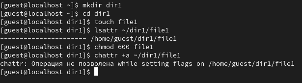
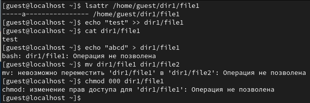
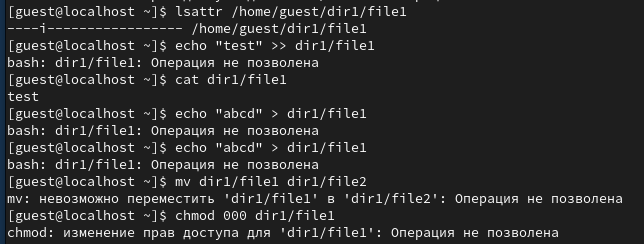

---
## Front matter
lang: ru-RU
title: Основы информационной безопасности
subtitle: Лабораторная работа № 4. Дискреционное разграничение прав в Linux. Расширенные атрибуты"
author:
  - Смирнов-Мальцев Е. Д.
institute:
  - Российский университет дружбы народов, Москва, Россия
date: 28 сентября 2024

## i18n babel
babel-lang: russian
babel-otherlangs: english

## Formatting pdf
toc: false
toc-title: Содержание
slide_level: 2
aspectratio: 169
section-titles: true
theme: metropolis
header-includes:
 - \metroset{progressbar=frametitle,sectionpage=progressbar,numbering=fraction}
---

# Информация

## Докладчик

:::::::::::::: {.columns align=center}
::: {.column width="70%"}

  * Смирнов-Мальцев Егор Дмитриевич
  * студент группы НКНбд-01-21
  * Российский университет дружбы народов
  
:::
::::::::::::::

# Цель работы

Получение практических навыков работы в консоли с расширенными атрибутами файлов.

# Выполнение лабораторной работы

## Работа с созданным файлом

{#fig:001 width=70%}

## Смена аттрибутов файла

{#fig:001 width=70%}

## Работа с файлом с аттрибутом a

{#fig:003 width=70%}

## Работа с файлом с аттрибутом i

{#fig:004 width=70%}

# Выводы

Получена информация о доступе к файлам c различными аттрибутами.
