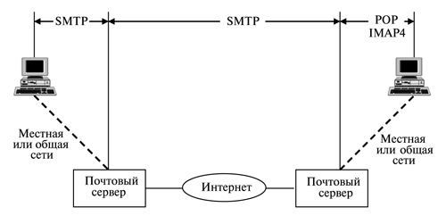

---
## Front matter
lang: ru-RU
title: Доклад
subtitle: Email injection
author:
  - Смирнов-Мальцев Е. Д.
institute:
  - Российский университет дружбы народов, Москва, Россия
date: 19 ноября 2024

## i18n babel
babel-lang: russian
babel-otherlangs: english

## Formatting pdf
toc: false
toc-title: Содержание
slide_level: 2
aspectratio: 169
section-titles: true
theme: metropolis
header-includes:
 - \metroset{progressbar=frametitle,sectionpage=progressbar,numbering=fraction}
---

# Информация

## Докладчик

:::::::::::::: {.columns align=center}
::: {.column width="70%"}

  * Смирнов-Мальцев Егор Дмитриевич
  * студент группы НКНбд-01-21
  * Российский университет дружбы народов
  
:::
::::::::::::::

# Введение

**Цель работы**

Изучить основные виды атак, использующих email-инъекции, а также способы защиты от них.

**Задачи**

- Описать уязвимости email протоколов
- Привести примеры атак, использующих эти уязвимости
- Пеечислить способы защиты от подобных атак

# Основы работы почты

## Почтовые протоколы

{#fig:001 width=80%}

## Конструкция письма

1. Конверт:
	```
	MAIL FROM: Отправитель
	RCPT TO: Получатель
	DATA: Начать письмо
	```
2. Письмо
* Content-Type: Тип содержимого
* From: Отправитель
* To: Получатель
* Subject: Тема
* Date: Дата и время

3. Тело письма

## Специальные конструкции

- Возврат каретки (Carriage Return): <CR>
- Перевод строки (Line feed): <LF>
- Пробел (Space): <SP>

# Виды атак

## CRLF инъекции

CRLF инъекция --- внедрение специальных конструкций для влияния на поведение почтовых протоколов.

Последствия CRLF инъекций:

* Возможность взаимодействия с локальными почтовыми серверами
* Утечка конфиденциальной информации
* Обход накладываемых на пользователя ограничений (обход капчи, рейт лимитов, ...). Как следствие, злоупотребление выделенными ресурсами, DoS
* Фишинг + рассылка вредоносного ПО
* Спам

## Arbitrary Command Flag Injection

Arbitrary Command Flag Injection --- внедрение дополнительных опций в исполняемую на целевой машине команду, которая отвечает за запуск почтового компонента.

Последствия:

* Запись в файлы на целевой машине
* Возможность удаленного исполнения кода

# Способы защиты от email инъекций

  - Использование функций кодирования специальных символов
  - Проверка и очистка пользовательского ввода
  - Регулярный мониторинг уязвимостей

# Выводы

В результате работы были рассмотрены основные уязвимости email протоколов для SQL инъекций.
