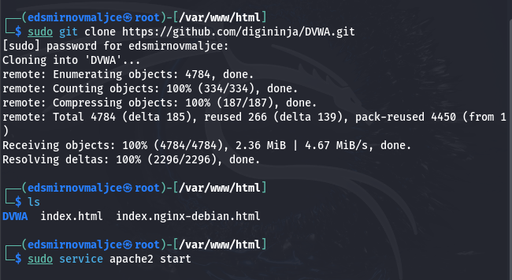
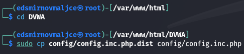
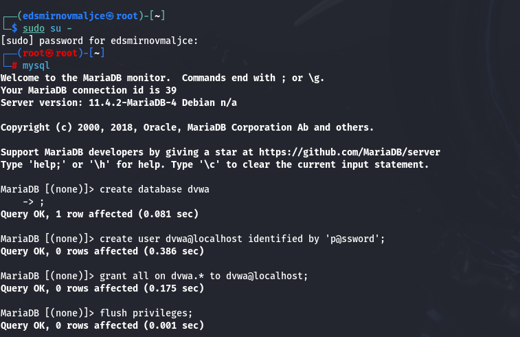
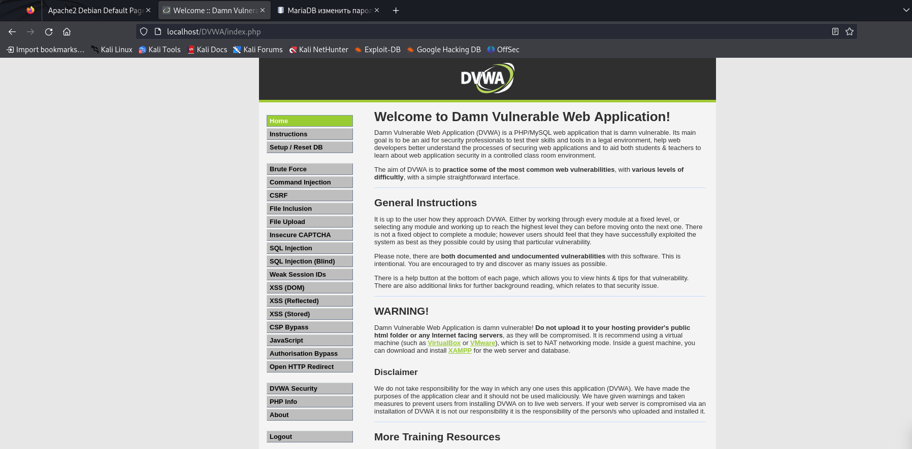

---
## Front matter
lang: ru-RU
title: Основы информационной безопасности
subtitle: Индивидуальный проект № 2. Установка DVWA
author:
  - Смирнов-Мальцев Е. Д.
institute:
  - Российский университет дружбы народов, Москва, Россия
date: 21 сентября 2024

## i18n babel
babel-lang: russian
babel-otherlangs: english

## Formatting pdf
toc: false
toc-title: Содержание
slide_level: 2
aspectratio: 169
section-titles: true
theme: metropolis
header-includes:
 - \metroset{progressbar=frametitle,sectionpage=progressbar,numbering=fraction}
---

# Информация

## Докладчик

:::::::::::::: {.columns align=center}
::: {.column width="70%"}

  * Смирнов-Мальцев Егор Дмитриевич
  * студент группы НКНбд-01-21
  * Российский университет дружбы народов
  
:::
::::::::::::::

# Цель работы

Установить DVWA.

# Теоретическое введение

## Уязвимости веб приложений, которые содержит DVWA

1. Брутфорс: Брутфорс HTTP формы страницы входа - используется для тестирования инструментов по атаке на пароль методом грубой силы и показывает небезопасность слабых паролей.
2. Исполнение (внедрение) команд: Выполнение команд уровня операционной системы.
3. Межсайтовая подделка запроса (CSRF): Позволяет «атакующему» изменить пароль администратора приложений.
4. Внедрение (инклуд) файлов: Позволяет «атакующему» присоединить удалённые/локальные файлы в веб приложение.
5. SQL внедрение: Позволяет «атакующему» внедрить SQL выражения в HTTP из поля ввода, DVWA включает слепое и основанное на ошибке SQL внедрение.
6. Небезопасная выгрузка файлов: Позволяет «атакующему» выгрузить вредоносные файлы на веб сервер.
7. Межсайтовый скриптинг (XSS): «Атакующий» может внедрить свои скрипты в веб приложение/базу данных. DVWA включает отражённую и хранимую XSS.
8. Пасхальные яйца: раскрытие полных путей, обход аутентификации и некоторые другие.

## Уровни безопасности DVWA

1. Невозможный — этот уровень должен быть безопасным от всех уязвимостей. Он используется для сравнения уязвимого исходного кода с безопасным исходным кодом.
2. Высокий — это расширение среднего уровня сложности, со смесью более сложных или альтернативных плохих практик в попытке обезопасить код. Уязвимости не позволяют такой простор эксплуатации как на других уровнях.
3. Средний — этот уровень безопасности предназначен главным образом для того, чтобы дать пользователю пример плохих практик безопасности, где разработчик попытался сделать приложение безопасным, но потерпел неудачу.
4. Низкий — этот уровень безопасности совершенно уязвим и совсем не имеет защиты. Его предназначение быть примером среди уязвимых веб приложений, примером плохих практик программирования и служить платформой обучения базовым техникам эксплуатации.

# Выполнение лабораторной работы

## Клонирование репозитория

{#fig:001 width=70%}

## Копирование конфигурационного файла

{#fig:001 width=70%}

## Создание пользователя

{#fig:003 width=70%}

## Стартовая страница DVWA

{#fig:004 width=70%}

# Выводы

DVWA установлен.
