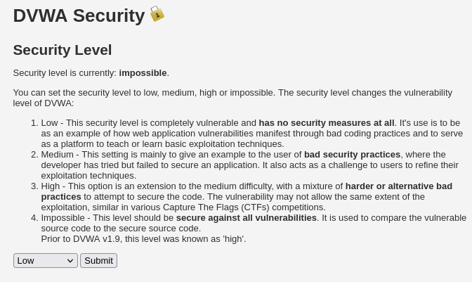
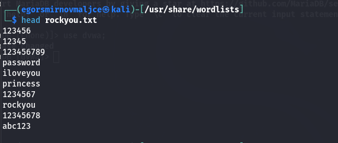
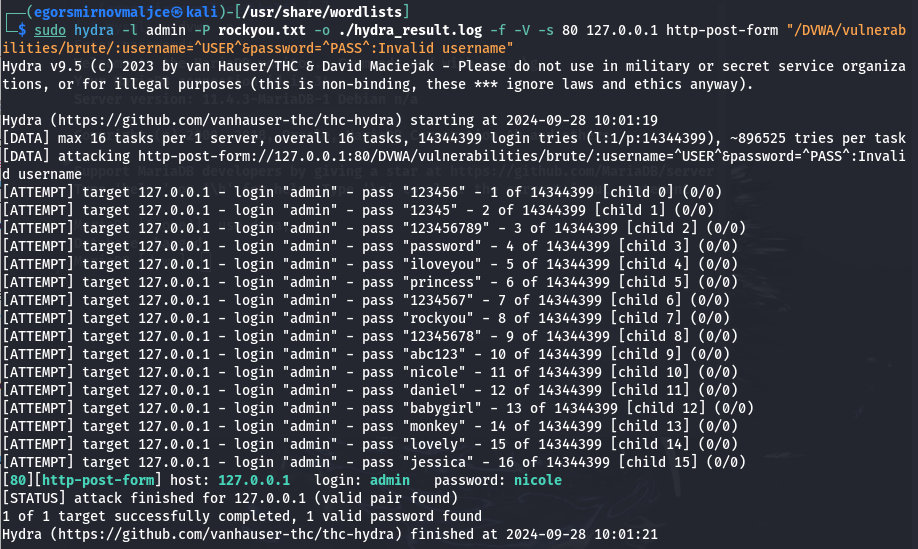
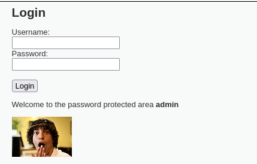

---
## Front matter
lang: ru-RU
title: Основы информационной безопасности
subtitle: Индивидуальный проект № 3. Использование Hydra
author:
  - Смирнов-Мальцев Е. Д.
institute:
  - Российский университет дружбы народов, Москва, Россия
date: 28 сентября 2024

## i18n babel
babel-lang: russian
babel-otherlangs: english

## Formatting pdf
toc: false
toc-title: Содержание
slide_level: 2
aspectratio: 169
section-titles: true
theme: metropolis
header-includes:
 - \metroset{progressbar=frametitle,sectionpage=progressbar,numbering=fraction}
---

# Информация

## Докладчик

:::::::::::::: {.columns align=center}
::: {.column width="70%"}

  * Смирнов-Мальцев Егор Дмитриевич
  * студент группы НКНбд-01-21
  * Российский университет дружбы народов
  
:::
::::::::::::::

# Цель работы

Научиться взламывать пользователя с помощью Hydra.

# Теоретическое введение

## Hydra

* Hydra используется для подбора или взлома имени пользователя и пароля.
* Поддерживает подбор для большого набора приложений.

## Пример работы Hydra

1. Исходные данные:
        IP сервера 178.72.90.181;
        Сервис http на стандартном 80 порту;
        Для авторизации используется html форма, которая отправляет по адресу http://178.72.90.181/cgi-bin/luci методом POST запрос вида username=root&password=test_password;
        В случае не удачной аутентификации пользователь наблюдает сообщение Invalid username and/or password! Please try again.

## Пример работы Hydra

2. Запрос к Hydra будет выглядеть примерно так:

```
    hydra -l root -P ~/pass_lists/dedik_passes.txt -o ./hydra_result.log -f -V -s 80 178.72.90.181 http-post-form "/cgi-bin/luci:username=^USER^&password=^PASS^:Invalid username"
```

## Пример работы Hydra

3. Используется http-post-form потому, что авторизация происходит по http методом post. После указания этого модуля идёт строка /cgi-bin/luci:username=^USER^&password=^PASS^:Invalid username, у которой через двоеточие (:) указывается:
* путь до скрипта, который обрабатывает процесс аутентификации (/cgi-bin/luci);
* строка, которая передаётся методом POST, в которой логин и пароль заменены на ^USER^ и ^PASS^ соответственно (username=^USER^&password=^PASS^);
* строка, которая присутствует на странице при неудачной аутентификации; при её отсутствии Hydra поймёт, что мы успешно вошли (Invalid username).


# Выполнение лабораторной работы

## Установка уровня безопасности

{#fig:001 width=70%}

## Наиболее частые пароли

{#fig:001 width=70%}

## Запрос к Hydra

{#fig:003 width=70%}

## Вход в учетную запись DVWA

{#fig:004 width=70%}

# Выводы

Мы смогли с помощью Hydra взломать пользователя в DVWA.
