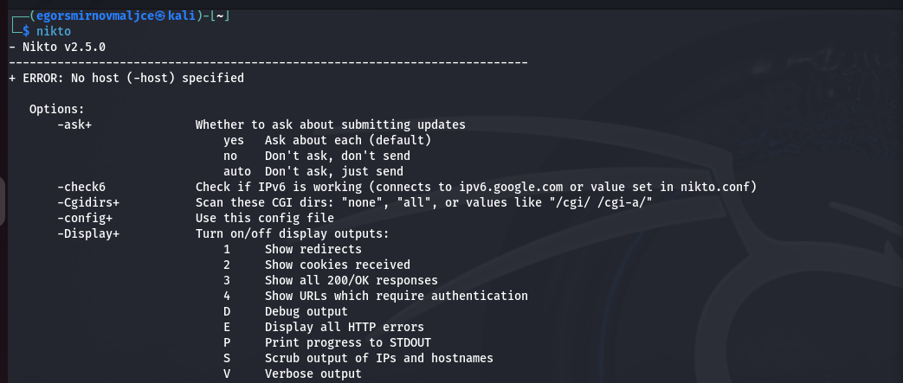
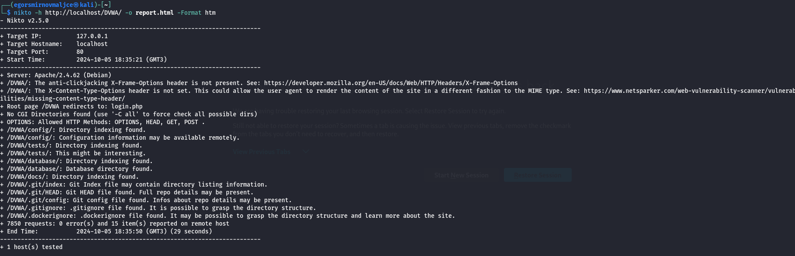

---
## Front matter
title: "Основы информационной безопасности"
subtitle: "Индивидуальный проект № 4. Использование nikto"
author: "Смирнов-Мальцев Егор Дмитриевич"

## Generic otions
lang: ru-RU
toc-title: "Содержание"

## Bibliography
bibliography: bib/cite.bib
csl: pandoc/csl/gost-r-7-0-5-2008-numeric.csl

## Pdf output format
toc: true # Table of contents
toc-depth: 2
lof: true # List of figures
lot: false # List of tables
fontsize: 12pt
linestretch: 1.5
papersize: a4
documentclass: scrreprt
## I18n polyglossia
polyglossia-lang:
  name: russian
  options:
	- spelling=modern
	- babelshorthands=true
polyglossia-otherlangs:
  name: english
## I18n babel
babel-lang: russian
babel-otherlangs: english
## Fonts
mainfont: PT Serif
romanfont: PT Serif
sansfont: PT Sans
monofont: PT Mono
mainfontoptions: Ligatures=TeX
romanfontoptions: Ligatures=TeX
sansfontoptions: Ligatures=TeX,Scale=MatchLowercase
monofontoptions: Scale=MatchLowercase,Scale=0.9
## Pandoc-crossref LaTeX customization
figureTitle: "Рис."
tableTitle: "Таблица"
listingTitle: "Листинг"
lofTitle: "Список иллюстраций"
lotTitle: "Список таблиц"
lolTitle: "Листинги"
## Misc options
indent: true
header-includes:
  - \usepackage{indentfirst}
  - \usepackage{float} # keep figures where there are in the text
  - \floatplacement{figure}{H} # keep figures where there are in the text
---

# Цель работы

Научиться определять уязвимости сайтов с помощью nikto.

# Теоретическое введение

nikto — базовый сканер безопасности веб-сервера. Он сканирует и обнаруживает уязвимости в веб-приложениях, обычно вызванные неправильной конфигурацией на самом сервере, файлами, установленными по умолчанию, и небезопасными файлами, а также устаревшими серверными приложениями.

Более подробно про Unix см. в [@tanenbaum_book_modern-os_ru; @robbins_book_bash_en; @zarrelli_book_mastering-bash_en; @newham_book_learning-bash_en].

# Выполнение лабораторной работы

Просмотрел флаги для команды nikto (рис. @fig:001).

{#fig:001 width=70%}

Создал с помощью nikto отчет о DVWA (рис. @fig:002).

{#fig:002 width=70%}

Просмотрел отчет (рис. @fig:003).

{#fig:003 width=70%}

# Выводы

Мы смогли с помощью nikto определить уязвимости DVWA.

# Список литературы{.unnumbered}

::: {#refs}
:::

