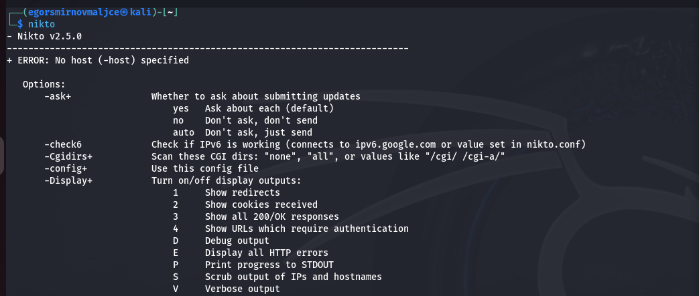
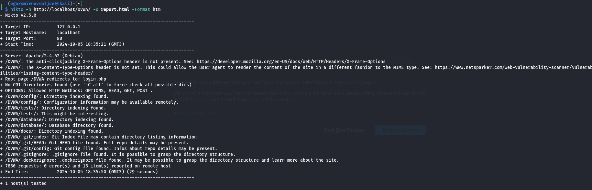
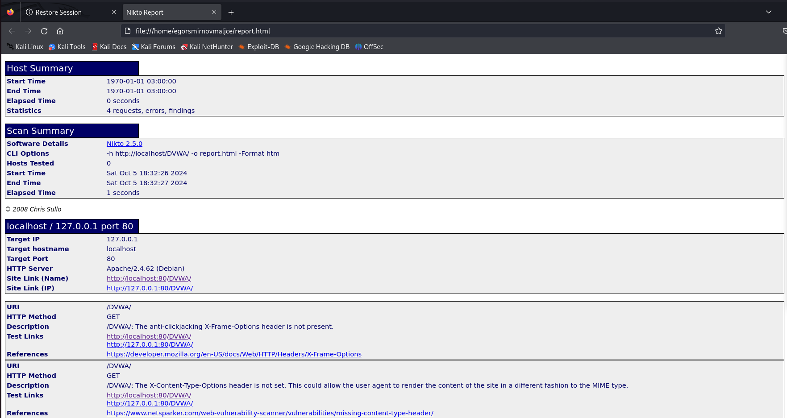

---
## Front matter
lang: ru-RU
title: Основы информационной безопасности
subtitle: Индивидуальный проект № 4. Использование nikto
author:
  - Смирнов-Мальцев Е. Д.
institute:
  - Российский университет дружбы народов, Москва, Россия
date: 5 октября 2024

## i18n babel
babel-lang: russian
babel-otherlangs: english

## Formatting pdf
toc: false
toc-title: Содержание
slide_level: 2
aspectratio: 169
section-titles: true
theme: metropolis
header-includes:
 - \metroset{progressbar=frametitle,sectionpage=progressbar,numbering=fraction}
---

# Информация

## Докладчик

:::::::::::::: {.columns align=center}
::: {.column width="70%"}

  * Смирнов-Мальцев Егор Дмитриевич
  * студент группы НКНбд-01-21
  * Российский университет дружбы народов
  
:::
::::::::::::::

# Цель работы

Научиться определять уязвимости сайтов с помощью nikto.

# Теоретическое введение

## nikto

nikto — базовый сканер безопасности веб-сервера. Он сканирует и обнаруживает уязвимости в веб-приложениях, обычно вызванные неправильной конфигурацией на самом сервере, файлами, установленными по умолчанию, и небезопасными файлами, а также устаревшими серверными приложениями.

# Выполнение лабораторной работы

## Экран помощи nikto

{#fig:001 width=70%}

## Создание отчета в nikto

{#fig:001 width=70%}

## Отчет nikto

{#fig:003 width=70%}

# Выводы

Мы смогли с помощью nikto определить уязвимости DVWA.
